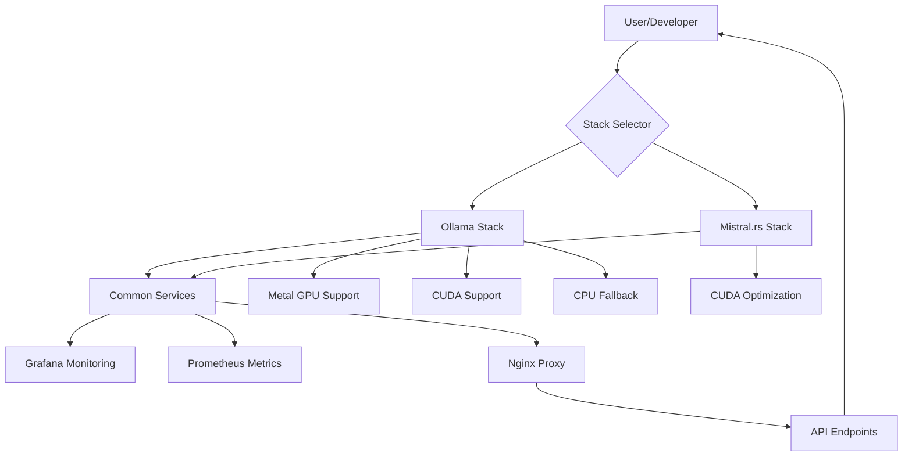

# Frontier LLM Stack

A complete self-hosted LLM infrastructure with coding agent capabilities, designed for Mac Studio but adaptable to other platforms.

## Overview

This project provides everything needed to run a powerful, self-hosted LLM environment with support for multiple inference engines. Choose the stack that best fits your hardware and requirements.

### Choosing an Inference Engine

| Feature | Ollama | Mistral.rs |
|---------|---------|------------|
| **Model Format** | GGUF | GGUF, SafeTensors |
| **API** | Ollama Native | OpenAI Compatible |
| **Performance** | Excellent* | Excellent* |
| **Model Library** | Extensive (Ollama Hub) | Manual Download |
| **Memory Usage** | Optimized | Highly Optimized |
| **Quantization** | Built-in (Q4-Q8) | Flexible (Q2-Q8) |
| **GPU Support** | Metal, CUDA, ROCm | CUDA (no Metal/ROCm) |
| **CPU Fallback** | Yes | Limited (GPU strongly recommended) |
| **Platform Support** | macOS, Linux, Windows | Linux (CUDA required) |
| **Production Status** | Stable | Experimental |
| **Model Pull** | Automatic (`ollama pull`) | Manual download (helper script available) |
| **API Compatibility** | Full Ollama API | OpenAI subset |

### Available Stacks
- **Ollama Stack** (Recommended) - Mature Go-based LLM serving with broad platform support
- **Mistral.rs Stack** (Experimental) - High-performance Rust-based inference for CUDA systems

### Common Features
- **Prometheus & Grafana** for comprehensive monitoring
- **Docker Compose** for easy deployment
- **Nginx** reverse proxy for secure access
- **Flexible stack selection** for choosing inference engines

## Prerequisites

### Hardware Requirements
- Mac Studio with M2/M3 Ultra (recommended)
- Minimum 64GB RAM (192GB recommended for Qwen3-235B)
- 500GB+ free storage (1TB+ for Qwen3-235B)
- MacBook Pro for remote development

### Software Requirements
- macOS Ventura or later
- Docker Desktop for Mac (Docker Compose v2.0+ required)
- Git
- SSH access between machines

## Quick Start

### Step 1: Clone and Configure

```bash
git clone https://github.com/yourusername/frontier-llm-mac-stack.git
cd frontier-llm-mac-stack
```

### Step 2: Select Your Stack

```bash
# List available stacks
./stack-select.sh list

# Select a stack based on your hardware:
# For macOS (Mac Studio/MacBook Pro with Apple Silicon):
./stack-select.sh select ollama

# For Linux with NVIDIA GPU:
./stack-select.sh select mistral

# Check current selection:
./stack-select.sh current
```

### Step 3: Configure Environment

```bash
# Copy the stack-specific environment template
cp .env.example .env
# Edit .env with your specific configuration
vim .env
```

### Step 4: Start the Stack

```bash
# Start all services
./start.sh

# Pull a model:
# For Ollama stack:
./pull-model.sh qwen2.5-coder:32b-instruct-q8_0

# For Mistral.rs stack (manual download required):
# Download models using the helper script:
# cd stacks/mistral && ./scripts/pull-model.sh <model-name>
# See docs/stacks/mistral/README.md for detailed model installation
```

### Step 5: Verify Installation

```bash
# Test the LLM API
# For Ollama:
curl http://localhost:11434/api/version

# For Mistral.rs:
curl http://localhost:11434/v1/models

# Access monitoring dashboards
open http://localhost:3000  # Grafana (check .env for credentials)
open http://localhost:9090  # Prometheus
```

## Setup Instructions (Detailed)

### Remote Mac Studio Setup

If deploying to a remote Mac Studio:

1. **Enable SSH Access on Mac Studio**
   - See [docs/ssh-setup-guide.md](docs/ssh-setup-guide.md) for detailed instructions
   - System Settings → General → Sharing → Enable Remote Login
   - Test: `ssh username@mac-studio.local`

2. **Clone on Both Machines**
   ```bash
   # On your MacBook Pro
   git clone https://github.com/yourusername/frontier-llm-mac-stack.git
   cd frontier-llm-mac-stack

   # On Mac Studio (via SSH)
   ssh username@mac-studio.local
   git clone https://github.com/yourusername/frontier-llm-mac-stack.git
   cd frontier-llm-mac-stack
   ```

3. **Run Setup on Mac Studio**
   ```bash
   # SSH to Mac Studio and follow the Quick Start steps above
   ssh username@mac-studio.local
   cd frontier-llm-mac-stack
   ./stack-select.sh select ollama
   # Continue with steps 3-5 from Quick Start
   ```

## Stack Management

This project uses a flexible multi-stack architecture that allows you to choose between different LLM inference engines.

### Stack Selection Guide

**Choose Ollama if you:**
- Use macOS with Apple Silicon (M1/M2/M3)
- Want automatic model management
- Need broad model compatibility
- Prefer stable, production-ready solution
- Require CPU fallback support

**Choose Mistral.rs if you:**
- Have Linux with NVIDIA GPU
- Want maximum inference performance
- Need OpenAI API compatibility
- Are comfortable with manual model management
- Want to experiment with cutting-edge features

### Available Commands

```bash
# Stack selection
./stack-select.sh list        # List available stacks
./stack-select.sh select <stack>  # Select a stack
./stack-select.sh current     # Show current stack

# Service management
./start.sh                    # Start all services
./stop.sh                     # Stop all services
./docker-compose-wrapper.sh ps     # Check service status
./docker-compose-wrapper.sh logs -f  # View logs

# Model management (Ollama stack)
./pull-model.sh               # Pull default model
./pull-model.sh <model-name>  # Pull specific model

# Model management (Mistral.rs stack)
# See docs/stacks/mistral/README.md#model-management
```

### Migrating Between Stacks

```bash
# Stop current stack
./stop.sh

# Select new stack
./stack-select.sh select <new-stack>

# Update environment configuration
cp .env.example .env
vim .env  # Update stack-specific settings

# Start new stack
./start.sh
```

For detailed stack information, see:
- [Ollama Stack Documentation](./docs/stacks/ollama/README.md)
- [Mistral.rs Stack Documentation](./docs/stacks/mistral/README.md)

## Manual Setup Options

### Native Ollama Installation (without Docker)

For users who prefer running Ollama natively:

```bash
# Install dependencies and Ollama
./scripts/setup/01-install-dependencies.sh
./scripts/setup/02-install-ollama.sh
./scripts/setup/03-configure-ollama-service.sh
./scripts/setup/04-pull-models.sh
./scripts/setup/05-install-aider.sh
```

### Building Mistral Stack from Source

```bash
# Select Mistral stack
./stack-select.sh select mistral

# Build the Docker image
cd stacks/mistral
./build.sh

# Return to root and start
cd ../..
./start.sh
```

## Architecture

### Stack Architecture Overview



**Text representation of architecture:**
- User/Developer interacts with Stack Selector
- Stack Selector routes to either Ollama or Mistral.rs stack  
- Both stacks integrate with common services (Grafana, Prometheus, Nginx)
- Ollama supports Metal, CUDA, ROCm, and CPU fallback
- Mistral.rs optimized for CUDA
- Nginx provides unified API endpoints

### Network Architecture

```
┌─────────────────┐         ┌──────────────────┐
│  MacBook Pro    │   LAN   │   Mac Studio     │
│                 ├─────────┤                  │
│ - Aider Client  │         │ - LLM Server     │
│ - Web Browser   │         │ - Monitoring     │
│                 │         │ - Docker Stack   │
└─────────────────┘         └──────────────────┘
```

## Services

### Core Services

- **LLM API Server** (port 11434): Ollama or Mistral.rs based on selected stack
- **Grafana** (port 3000): Metrics visualization and dashboards
- **Prometheus** (port 9090): Time-series metrics collection
- **Nginx** (port 80/443): Reverse proxy with SSL support
- **Node Exporter** (port 9100): System metrics collection

### Access Points

After starting the stack:
- LLM API: `http://localhost:11434`
- Grafana Dashboard: `http://localhost:3000` (check .env for credentials)
- Prometheus: `http://localhost:9090`
- Metrics: `http://localhost:9100/metrics`

## Using Aider

### With Docker
```bash
# Run Aider in Docker container
docker compose run --rm aider aider /workspace/your-project
```

### Native Installation
```bash
# Install Aider
pip install aider-chat

# Configure for remote Ollama
export OLLAMA_API_BASE="http://mac-studio.local:11434"
# Note: For production use, configure SSL/TLS with HTTPS

# Run Aider
aider --model ollama/qwen2.5-coder:32b-instruct-q8_0
```

## Monitoring

Access Grafana at `http://localhost:3000` to view:
- Model response times
- Memory usage
- GPU utilization (if available)
- Request throughput

## Models

### Initial Setup Model

**Qwen2.5-Coder:32b** - Start with this for faster setup and testing
```bash
./pull-model.sh qwen2.5-coder:32b-instruct-q8_0
```

### Production Model: Qwen3-235B

Once your setup is working, upgrade to the full Qwen3-235B model:

1. **Check system resources:**
   ```bash
   # Ensure you have ~500GB free space
   df -h /

   # Check memory (need 192GB+ for optimal performance)
   sysctl hw.memsize | awk '{print $2/1024/1024/1024 " GB"}'
   ```

2. **Pull Qwen3-235B (when available in Ollama):**
   ```bash
   # This will take significant time and bandwidth
   ./pull-model.sh qwen3:235b-instruct-q8_0
   ```

3. **If Qwen3-235B isn't directly available, see manual conversion:**
   - Instructions in `specifications/local-llm-stack-setup.md` (Appendix C)
   - Requires downloading original weights and converting to GGUF format
   - Consider Q4_K_M or Q5_K_M quantization for size/quality balance

4. **Update Aider configuration:**
   ```bash
   # Edit ~/.aider.conf.yml
   # Change model to: ollama/qwen3:235b-instruct-q5_k_m
   ```

### Other Recommended Models

*Performance claims are approximate and depend on hardware configuration, model size, and quantization level.

- **DeepSeek-Coder:33b** - Excellent code understanding
- **CodeLlama:70b** - Meta's largest code model
- **Mixtral:8x7b** - Fast MoE architecture

## Helper Scripts

- `./start.sh` - Start all services
- `./stop.sh` - Stop all services
- `./pull-model.sh [model]` - Download an Ollama model
- `./logs.sh [service]` - View service logs

## Configuration

### Environment Variables

Edit `.env` file to customize:
- Memory limits
- Model paths
- Port mappings
- Authentication settings

For a comprehensive list of all environment variables, see [docs/ENVIRONMENT_VARIABLES.md](docs/ENVIRONMENT_VARIABLES.md).

### Adding SSL

1. Place certificates in `config/ssl/`
2. Update `config/nginx/default.conf` for HTTPS
3. Update `.env` with SSL paths

## Troubleshooting

### Ollama not accessible
```bash
# Check if service is running
docker compose ps

# View logs
./logs.sh ollama

# Test API
curl http://localhost:11434/api/version
```

### Memory issues
- Reduce `OLLAMA_MEMORY_LIMIT` in `.env`
- Use smaller model quantizations (q4 instead of q8)

### Slow responses
- Check available memory: `docker stats`
- Reduce concurrent requests: `OLLAMA_NUM_PARALLEL=2`

## Project Structure

```
frontier-llm-mac-stack/
├── stack-select.sh         # Stack selection tool
├── docker-compose-wrapper.sh  # Multi-stack compose wrapper
├── start.sh               # Start selected stack
├── stop.sh                # Stop all services
├── pull-model.sh          # Model download tool
├── .env.example           # Common environment template
├── stacks/
│   ├── common/           # Shared services (monitoring, nginx)
│   ├── ollama/           # Ollama stack configuration
│   └── mistral/          # Mistral stack configuration
├── scripts/
│   ├── setup/            # Installation scripts
│   ├── testing/          # Integration tests
│   └── validate-env.sh   # Environment validation
├── config/               # Runtime configurations
│   ├── ollama/          # Ollama-specific configs
│   ├── mistral/         # Mistral-specific configs
│   └── aider/           # Aider configuration
├── docs/
│   └── stacks/          # Stack-specific documentation
└── specifications/       # Implementation plans
```

## Troubleshooting SSH Connection

If you can't connect via SSH:

1. **Check Mac Studio is on the same network:**
   ```bash
   # On Mac Studio
   ifconfig | grep "inet " | grep -v 127.0.0.1
   ```

2. **Check firewall settings:**
   ```bash
   # On Mac Studio
   sudo /usr/libexec/ApplicationFirewall/socketfilterfw --getglobalstate
   ```

3. **Try IP address instead of hostname:**
   ```bash
   # Find IP on Mac Studio
   ipconfig getifaddr en0

   # Connect from MacBook
   ssh username@192.168.x.x
   ```

## Performance Optimization

See stack-specific documentation for detailed resource allocation guidance.

Quick tips for best performance:

1. **Configure Docker Desktop (macOS):**
   - Settings → Resources → Memory: 80% of system RAM
   - Settings → Resources → CPUs: Number of cores - 2

2. **Adjust memory limits in .env:**
   ```bash
   OLLAMA_MEMORY_LIMIT=64G
   OLLAMA_MEMORY_RESERVATION=32G
   ```

3. **Monitor resource usage:**
   - Grafana dashboards: http://localhost:3000
   - Real-time stats: `docker stats`

## Contributing

See [CONTRIBUTING.md](CONTRIBUTING.md) for guidelines.

## License

MIT License - see [LICENSE](LICENSE) file.