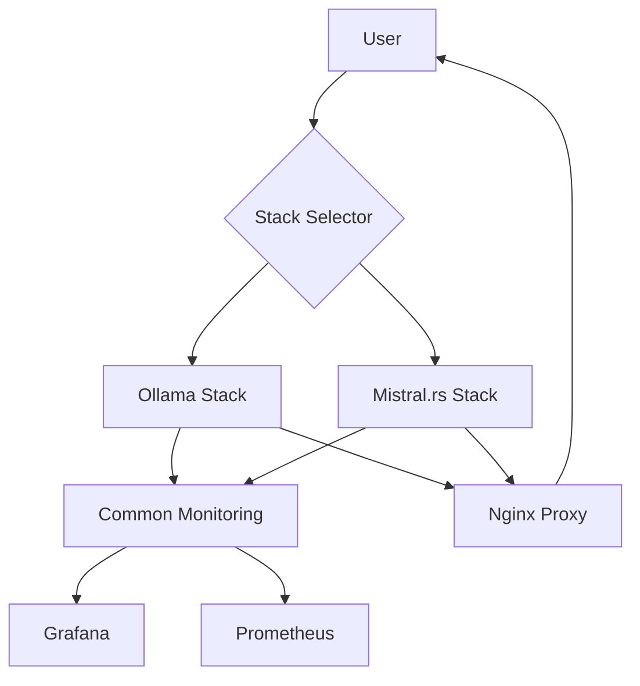

# MISTRAL_000010: Update Documentation for Multi-Stack Support

## Objective
Comprehensively update all documentation to reflect the new multi-inference engine architecture, including setup instructions, usage guides, and troubleshooting for both Ollama and Mistral.rs stacks.

## Context
The project now supports multiple inference engines. Documentation needs to clearly explain how to choose, configure, and use each stack while maintaining clarity for new users.

## Tasks

### 1. Update Main README
- Add stack selection instructions
- Create comparison table between Ollama and Mistral.rs
- Update architecture diagrams
- Add quick start for each stack

### 2. Create Stack-Specific Documentation
- Create `docs/stacks/mistral/README.md`
- Document Mistral.rs specific features
- Add model compatibility guide
- Include performance tuning guide

### 3. Update Setup Guides
- Modify automated setup instructions
- Add stack selection to swissarmyhammer workflow
- Update manual setup procedures
- Document migration between stacks

### 4. Create Troubleshooting Guide
- Common issues with Mistral.rs
- API compatibility problems
- Performance optimization tips
- Model format conversions

## Implementation Details

```markdown
# README.md updates

## Choosing an Inference Engine

This project supports multiple inference engines:

| Feature | Ollama | Mistral.rs |
|---------|---------|------------|
| Model Format | GGUF | GGUF, HF, Safetensors |
| API | Ollama Native | OpenAI Compatible |
| Performance | Excellent | Excellent |
| Model Library | Extensive | Growing |
| Memory Usage | Optimized | Highly Optimized |
| Quantization | Built-in | Flexible |

### Quick Start

1. **Choose your stack:**
   ```bash
   ./stack-select.sh mistral  # or ollama
   ```

2. **Start services:**
   ```bash
   ./start.sh
   ```

3. **Pull a model:**
   ```bash
   # For Ollama
   ./pull-model.sh qwen2.5-coder:32b

   # For Mistral.rs
   ./stacks/mistral/scripts/pull-model.sh qwen2.5-coder:32b q5_k_m
   ```

## Architecture


```

## Success Criteria
- Documentation is clear and comprehensive
- New users can easily choose and set up their preferred stack
- Migration between stacks is well documented
- Troubleshooting covers common issues

## Estimated Changes
- ~500 lines of documentation updates
- New diagrams and architecture illustrations
- Updated examples and guides

## Proposed Solution

1. **Analyze current documentation structure**
   - Review existing README.md
   - Check for any existing documentation directories
   - Identify gaps between current docs and multi-stack requirements

2. **Update main README.md**
   - Add clear stack selection instructions at the top
   - Create comprehensive comparison table between Ollama and Mistral.rs
   - Add architecture diagram showing both stacks
   - Include quick start sections for each stack
   - Update existing sections to be stack-agnostic where appropriate

3. **Create Mistral.rs stack documentation**
   - Create `docs/stacks/mistral/README.md`
   - Document Mistral.rs specific features and capabilities
   - Add model compatibility guide and format requirements
   - Include performance tuning parameters and optimization tips
   - Document API endpoints and differences from Ollama

4. **Update setup documentation**
   - Modify automated setup instructions to include stack selection
   - Update swissarmyhammer workflow documentation
   - Document manual setup procedures for each stack
   - Add migration guide for switching between stacks
   - Document environment variables and configuration options

5. **Create troubleshooting guide**
   - Document common Mistral.rs issues and solutions
   - Add API compatibility troubleshooting
   - Include performance optimization tips
   - Document model format conversion procedures
   - Add debugging tips for both stacks

6. **Validate documentation**
   - Ensure all commands and examples work
   - Check for consistency across documentation
   - Verify links and references are correct
   - Test quick start guides for both stacks